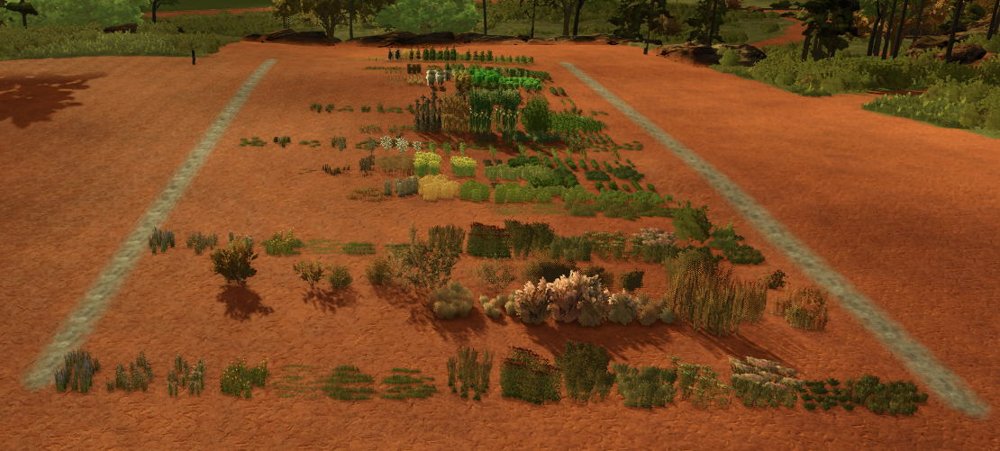

# A word on AI driven/assisted FS25 mod development

Hey here, this is the actual human speaking :D
I'm a well seasoned mainly linux system engineer, but I touch code
regularly, but barely anything as complex as this. 

For the technical setup documentation, please have a look at [AI_DEV_GUIDE.md](AI_DEV_GUIDE.md). 

About 99% of everything in these 2 git repos is AI generated
by claude code, bringing me from 0 knowledge of game design nor engine, to 
at least a decent understanding what is possible and some functional code, 
in about 2 weeks of work off and on. 

Of course this is about the worst thing someone can do to an AI. 
Incomplete documentation (at least for this depth of holding my fingers into
the core engine), a developer who does not know the engine and neither how
to start with a simple project. Let's just dive straight into the engine core
and let's see where we end up. 

Lifelines: Other mods, that touch similar directions in the Engine (credits are in the Readme's).
And then it's just, either checkout that other mod/git repo locally, or point the AI to 
the github url and make it reason "why this mod works" and "if we can do something similar".

And yea... Then this mod "happened", to be able to basically walk around in the
world and look at things, to prove we're in the right ballpark with our assumptions, 
together with handy debug functions like "please place all defined deco foliage stages
at my position". Proving the code indeed has a way to place things in the world, before
having the same thing happening on a random interval all over the map in IW. 

In reality the development cycle was mostly Claude telling me "ok start game, please 
look at that grass patch" screenshot WAILA HUD, then run this debug function, while
Claude already had a background monitoring process looking at log.txt. So it would
usually already have identified and fixed the problem, before I even noticed. 

# Gotchas

Specifically for people who are new to AI assisted development:

Tested several AI's with this, as I said, about worst case you can do to an AI. 

LLM based AI's have a "compiled" core (the LLM), that got "trained" by information
from the internet, official documentations, etc. The FS25 Core is closed source, 
there's a very thin sdk documentation, but of course for this amount of work in 
the engine, that was nowhere near enough. It was kind of interesting to compare different
AI's in this "worst case scenario". 

## AI Choice

* google gemini (free version) -> would deliver beautifully looking lua scripts... 
  With entirely plausible sounding core function names.. Problem is just they were
  completely made up. (The famous AI hallucinations). AI does not know information,
  somehow arrives at an approximate assumption and sells you that as "absolutely 
  working code". 
  Leaving you with a completely broken puzzle that will just throw exceptions for
  days, while being already convoluted enough, that you have a hard time debugging
  manually. 

* claude code (paid, with client installed) -> the actual breakthrough: Having 
  AI running directly inside the  development environment, allows it to keep
  its context much better, than a simple chat. Also claude will consistently
  tell you "I don't think this is possible", until you convince it otherwise
  with some evidence, rather than just make something up that looks impressive,
  but costs you days to uncover all the hallucinated eastereggs. 
  Chats are perfectly useable, for simple things, where you just 
  want syntactically correct lua code, but you know the engine functions you're 
  calling actually exist. But here, we more or less ended up with a local folder
  full of unzipped "other mods" that were working in the engine in similar corners,
  so the AI would just go search for references in there automatically. 

* chatgpt (free or paid chat depending on volume, but without the client) 
  -> better... But still hallucinating.. And of course suffering of constantly
  drifting context, because up/download a code zip is painful. Possible for
  simple things, but not for something as complex as this. 
  The area where chatgpt is definitely better than claude code, is creativity. So
  for the first couple "brainstorming sessions" while you're trying to figure out
  the scope of what you're trying to do, chatgpt is much more useful.
  And also it comes with a builtin image generator that claude does not have. 
  So I will on a regular base use both (or all 3) at the same time, comparing
  the results is also a way to uncover hallucinations. 

## Context windows

All LLM based AI's will only have a limited "context window", defining how much
of your pages and pages of "chat" the AI will "remember". 
So if at the very start of the module, you told it "rut chances are rolled once per
tyre hitting it", and at some point for some unrelated debug exercise that condition
got changed, the AI might not remember the original condition or reason itself into
believing you changed your mind. 

To counter this: If you know exactly what you want to do before going into the project, 
drop a README.md, or function.md or whatever into the project, where you describe
in detail what the project is supposed to do, and e.g how you'd like to have it 
structured (modules, paths, etc). The AI can pin something like that as a constant 
part of the context that will be passed through the LLM for every query, so having
the project gradually drifting away from your initial idea is not possible. 

## iiih...git

Yes seriously. Have a git repo. 
The AI will happily manage it for you and if you ask, teach you how to use it too. 
You just tell it "ok, this is a tested stage now", that's worth a tag in the git repo, 
and you or the AI will forever be able to compare whatever future mess happens with this
verified status. 

The easiest case: Install git, inside the wsl, just do "git init ." in the project source
directory.. Add any already existing files to the repo (git add .), git commit -m "initial status"..,
done. You don't need a github account yet, you can always add the remote origin later. 
The local repo is already able to keep track of changes. 
